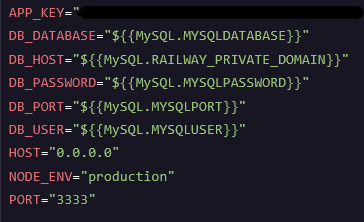

# Documentation sur le travail effectué avec docker

## C'est quoi docker ?

Docker, c’est une technologie qui utilise le noyau du système d’exploitation pour créer des [**conteneurs**](#cest-quoi-un-container-docker-), c’est-à-dire des environnements isolés, légers et autonomes, dans lesquels on peut exécuter des programmes. Ces conteneurs partagent le même système d’exploitation mais fonctionnent comme s’ils étaient indépendants, avec leurs propres fichiers, processus et réseau. Docker fournit les outils pour créer, gérer et lancer ces conteneurs à partir d’[**images**](#cest-quoi-une-image-docker-), qui sont comme des modèles figés contenant tout le nécessaire pour faire tourner un programme.

## C'est quoi une **image docker** ?

Une image Docker est la base d'un conteneur Docker. Lors de la création d'un conteneur, on lui spécifie toujours une image de référence. Celle-ci peut contenir un simple système d'exploitation ou inclure un environnement complet prêt à l'emploi (par exemple : Node.js préinstallé).

Les images proviennent d'un registre (registry). Par défaut, on utilise Docker Hub, le registre officiel de Docker, permettant de télécharger des images publiques prêtes à l'emploi.

## C'est quoi un **container docker** ?

Un conteneur, c’est un environnement isolé dans lequel tourne une application avec tout ce dont elle a besoin : ses fichiers, ses bibliothèques, ses dépendances, etc. Il utilise le système d’exploitation de la machine hôte mais reste cloisonné, comme une mini-machine virtuelle ultra-légère. Chaque conteneur pense qu’il est seul sur la machine, même s’il y en a plein d’autres à côté. C’est un processus standard, mais enfermé dans un espace contrôlé et reproductible.

Contrairement à une machine virtuelle, un conteneur ne contient pas de système d’exploitation complet, donc il démarre plus vite, consomme moins de ressources, et peut être lancé en grand nombre sur la même machine sans surcharge. C’est un processus normal comme n'importe quelle application, mais exécuté dans un espace contrôlé, indépendant et reproductible.

## C'est quoi un `Dockerfile` ?

Un Dockerfile est un fichier texte qui contient les instructions permettant de construire une image Docker. Il agit comme un script listant les étapes que Docker doit suivre pour créer une image personnalisée. On y spécifie les actions à effectuer : installation de dépendances, copie de fichiers, configuration d'environnement, définition de la commande de démarrage, etc. L'image ainsi créée pourra ensuite être utilisée pour lancer un ou plusieurs conteneurs identiques.

## Explication du dockerfile créé

> Le dockerfile peut être trouvé [ici](../Dockerfile).

### Image de base

On commence toujours par définir une image de base. Ici, nous utilisons node:20.12.2-alpine3.18. Cela signifie que l'image utilise Node.js en version 20.12.2 sur une distribution Alpine Linux 3.18, légère et sécurisée, idéale pour des environnements de production.

On lui donne l'alias `base`, ce qui permet de réutiliser cette image dans les autres étapes sans avoir à la re-spécifier.

### Multi-stage build

Le multi-stage build est une technique permettant de séparer les étapes de construction pour produire une image finale plus légère. Elle évite d'inclure des outils inutiles (compilateurs, dépendances de dev...) dans l'image finale.

Exemple : on compile une application dans une première image, puis on copie uniquement les fichiers compilés dans l'image finale.

Dans notre cas :

- On installe les dépendances
- On sépare les dépendances de production
- On build l'application
- On crée l'image finale avec uniquement ce qui est nécessaire

Ce processus améliore l'efficacité, la sécurité et permet de tirer parti du cache Docker pour éviter de refaire des étapes inutiles.

### Les commandes utilisées

- `FROM` : Précise à docker l'image de base à utiliser. L'ajout de `AS` permet de faire référence à l'image créée dans le reste du dockerfile.
- `WORKDIR` : permet de spécifier le répertoire de travail dans le container donc c'est là où les commandes seront exécutées
- `ADD` permet de copier un ou plusieurs fichiers/dossiers dans le container docker.
- `RUN` permet d'exécuter des commandes dans le container.
- `COPY` c'est comme ADD sauf qu'il permet d'ajouter plus de paramètres. Ici nous l'utilisons car il permet de lui spécifier avec l'option --from que l'on souhaite copier depuis le container avec l'alias `build` par exemple.
- `ENV` permet de spécifier des variables d'environnement qui seront donc ajoutées dans un fichier `.env` dans le container docker
- `EXPOSE` permet de préciser un port à "exposer" qui sera donc utilisable à l'extérieur du container quand on le configurera lors de la création d'un container avec l'option --port (ou -p)
- `CMD` est tout à la fin, il définit la commande qui est exécutée par défaut lors du lancement du container donc ici au lancement du container nous souhaiterons lancer notre application web et donc de lancer la commande `node ./bin/server.js`.

### Explication ligne par ligne de notre dockerfile

```Dockerfile
# On utilise une image de base déjà prête : Node.js version 20.12.2 sur Alpine Linux (très léger).
# On lui donne un nom (alias) : "base"
FROM node:20.12.2-alpine3.18 AS base

# On crée une étape pour installer toutes les dépendances (dev + prod)
FROM base AS deps
# On se place dans le dossier /app du container
WORKDIR /app
# On ajoute les fichiers package.json et package-lock.json dans ce dossier
ADD package.json package-lock.json ./
# On installe toutes les dépendances exactement comme dans le lockfile
RUN ["npm","ci"]

# On crée une autre étape, cette fois pour n’installer que les dépendances de production (--omit-dev -> ignore les dépendances de développement)
FROM base AS production-deps
WORKDIR /app
ADD package.json package-lock.json ./
RUN ["npm","ci","--omit=dev"]

# On crée une étape pour "construire" (compiler(source -> machine)/transpiler(source -> source)) l’application
FROM base AS build
WORKDIR /app
# On récupère les node_modules de l’étape deps
COPY --from=deps /app/node_modules /app/node_modules
# On ajoute tous les fichiers du projet (code, configs…)
ADD . .
# On lance le script de build de l'application (souvent pour transformer le code source)
RUN ["node","ace","build"]


# Étape finale : l'image qui servira à exécuter notre app en production
FROM base
# On définit quelques variables d’environnement pour l’appli
ENV LOG_LEVEL=info
ENV SESSION_DRIVER=cookie
WORKDIR /app
# On copie seulement les node_modules de production (plus léger)
COPY --from=production-deps /app/node_modules /app/node_modules
# On copie le code déjà compilé
COPY --from=build /app/build /app
# On indique que le container utilisera le port 3333
EXPOSE 3333
# On précise la commande à lancer automatiquement : démarrer le serveur Node.js
CMD ["node", "./bin/server.js"]

```

## Construire l'image

Pour construire une image, nous utilisons la commande suivante :

```bash
docker image build -t flashcards-app .
```

- On utilise la commande `docker` : `build` sur une `image`.
- On utilise l'option `-t` pour ajouter un tag à l'image afin de pouvoir la retrouver plus facilement (ici, on met `flashcards-app` comme tag).
- Le chemin vers le Dockerfile. Ici, étant dans le même dossier, on met `.` pour faire référence au dossier actuel.

## Création d'un container à partir de l'image créée

Pour créer un conteneur suite à la [création de l'image précédente](#construire-limage), il faut exécuter la commande suivante :

```bash
docker container run -d --name "flashcards-wof" flashcards-app
```

- On exécute la commande `docker run`, qui permet de gérer les conteneurs, créant et exécutant un conteneur (en gros, cela crée le processus correspondant à un conteneur Docker).
- `-d` : Précise qu'on veut faire tourner le conteneur en arrière-plan.
- `--name "flashcards-wof"` : Permet de donner un nom à notre conteneur pour l'éditer plus facilement par la suite.
- `flashcards-app` : À partir de l'image avec le tag `flashcards-app` (ou `flashcards-app:latest`).

## Déploiement sur le web (avec l'aide de [Railway](https://railway.com/))

> Choix détaillé de l'hébergeur [ici](./comparaisonHebergeur.md)

Pour commencer il faut créer un projet sur Railway via l'interface (une fois connecté)


Railway nous permet directement de déployer depuis un repo Github (ça tombe bien !) c'est donc ce que nous allons utiliser.


Ensuite on peut sélectionner le repo une fois connecté. Ici on choisit le repo du projet flashcards.
Railway s'occupe à partir d'ici de comprendre où est le dockerfile, de créer l'image et le container mais il faut quand même en plus créer une base de données MySQL grâce au bouton "create" puis "Database" puis "Add MySQL".

Il suffit uniquement de configurer les variables d'environnement suivantes sur l'élément correspondant au repo Github en ajoutant votre valeur personnelle de "APP_KEY".



> Si nécessaire complétez également les variables d'environnement de la base de données MySQL.

Pensez également qu'il est nécessaire de créer les tables de la base de données. Il existe différentes méthodes. Il est possible de se connecter à la base de données via une instance que vous avez localement de l'application web et d'exécuter donc localement la commande suivante permettant de créer la base de données :

```bash
node ace migration:run
```

Cette commande exécutera les migrations de la base de données afin de créer les tables utiles.

## Exécuter tous les containers docker à l'aide d'un docker-compose

### C'est quoi un `docker-compose.yml` ?

### Explication ligne par ligne de celui réalisé

> Le fichier `docker-compose.yml` est disponible [ici](../docker-compose.yml)

```yml
# "services" liste les containers à créer
services:
  db: # Le premier container se nomme "db"
    image: mysql # Le container "db" est issu de l'image "mysql" (provenant de docker hub)
    ports: # Le container exposera son port "3306" sur le port "3306" de la machine hôte
      - 3306:3306
    environment: # Configuration des variables d'environnement du container
      - MYSQL_ROOT_PASSWORD=${DB_PASSWORD} # variable d'environnement correspondant au mot de passe de l'utilisateur root de la db. La valeur de la variable d'environnement est récupérée dans le .env dans le répertoire courant avec la syntaxe ${nom_variable_env}.
      - MYSQL_DATABASE=${DB_DATABASE} # variable d'environnement correspondant à la base de données créée par défaut. La valeur de la variable d'environnement est récupérée dans le .env dans le répertoire courant avec la syntaxe ${nom_variable_env}.
  web: # Création d'un container nommé "web"
    build: . # Ce container est issu d'une image construite (build) à partir d'un `Dockerfile` dans le répertoire courant
    ports: # Le container exposera son port "3333" sur le port "3333" de la machine hôte
      - 3333:3333
    environment:
      - APP_KEY=${APP_KEY} # Clé secrète utilisée par AdonisJS. La valeur de la variable d'environnement est récupérée dans le .env dans le répertoire courant avec la syntaxe ${nom_variable_env}.
      - DB_DATABASE=${DB_DATABASE} # Nom de la db utilisée. La valeur de la variable d'environnement est récupérée dans le .env dans le répertoire courant avec la syntaxe ${nom_variable_env}.
      - DB_USER=root # Nom de l'utilisateur de la db utilisé
      - DB_PASSWORD=${DB_PASSWORD} # mot de passe de l'utilisateur de la db utilisé (ici "root"). La valeur de la variable d'environnement est récupérée dans le .env dans le répertoire courant avec la syntaxe ${nom_variable_env}.
      - DB_HOST=db # Le nom d'hôte de la base de données. Ici "db" fait automatiquement référence au nom d'hôte du container se nommant "db" créé dans le même docker-compose.yml
      - DB_PORT=3306 # Port utilisé par la base de données
      - HOST=0.0.0.0 # Nom d'hôte où node devra écouter pour récupérer les requêtes HTTP
      - PORT=3333 # Port où node devra écouter pour récupérer les requêtes HTTP
      - NODE_ENV=production # Mode d'exécution de l'application (ici : production (ça peut aussi être par exemple "debug"))
    command: sh -c "sleep 30 && node ace migration:run --force && exec node ./bin/server.js" \
    # Remplace la commande par défaut du Dockerfile :
    # attend 30s (le temps que la base de données soit prête), exécute les migrations,
    # puis lance le serveur. Le `sh -c` permet de chaîner les instructions dans un seul processus (et donc d'éviter que le container se ferme).
```
