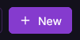
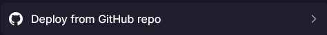
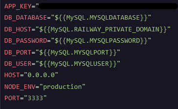

# Déploiement sur le web (avec l'aide de [Railway](https://railway.com/))

Nous avons souhaité déploié notre application en production pour cela nous avons dû choisir un hébergeur respectant certaines containtes. Nous avons fini par choisir [Railway](https://railway.com/) qui respecte nos demandes ([choix détaillé ici](./comparaisonHebergeur.md))

## Contexte technique de production

Nous avons développez une application en AdonisJS de flashcards. Cette application nécessite une base de données MySQL (il est possible de changer facilement de SGBDR au besoin grâce à l'ORM Lucid mais nous avons préféré rester sur notre choix de départ de préférence c'est-à-dire MySQL)

Nous hébergeons notre code sur Github afin de versionner notre code en suivant les bonnes pratique pour les nommages des commits (Commits conventionnels).

En résumé nous avons besoin de :

- Une base de données MySQL de préférence (ou autres SGBDR si changement nécessaire)
- Un serveur node avec les dépendances indispensable à notre application soit les dépendances demandées par Adonis et leurs outils (Lucid pour l'ORM, Edge pour le moteur de templates, etc.)

> Ces contraintes ont donc été pris en considération lors du [choix de l'hebergeur](./comparaisonHebergeur.md).

## Etapes pour dépoier l'application

> Pour déployer nous utilison ici le Dockerfile expliqué [ici](./docker-doc.md#explication-du-dockerfile-créé).

Pour commencer, il faut créer un projet sur Railway via l'interface (une fois connecté)



Railway nous permet directement de déployer depuis un repo Github (ça tombe bien !) c'est donc ce que nous allons utiliser.



Ensuite on peut sélectionner le repo une fois connecté. Ici on choisit le repo du projet flashcards.
Railway s'occupe à partir d'ici de comprendre où est le dockerfile, de créer l'image et le container mais il faut quand même en plus créer une base de données MySQL grâce au bouton "create" puis "Database" puis "Add MySQL".

Il suffit uniquement de configurer les variables d'environnement suivantes sur l'élément correspondant au repo Github en ajoutant votre valeur personnelle de "APP_KEY".



> Si nécessaire complétez également les variables d'environnement de la base de données MySQL.

Pensez également qu'il est nécessaire de créer les tables de la base de données. Il existe différentes méthodes. Il est possible de se connecter à la base de données via une instance que vous avez localement de l'application web et d'exécuter donc localement la commande suivante permettant de créer la base de données :

```bash
node ace migration:run
```

Cette commande exécutera les migrations de la base de données afin de créer les tables utiles.

## Mise à jour de l'application déployée lors d'un incrément

Lorsqu'une mise à jour est développée, l'avantage d'utiliser Railway est qu'il met automatiquement à jour l'application en fonction du repository. Ainsi, dès qu'une mise à jour est commitée et poussée, Railway détecte automatiquement les changements et déploie la nouvelle version. Il n'y a donc rien d'autre à faire que de _commit_ et _push_ les nouveautés.
